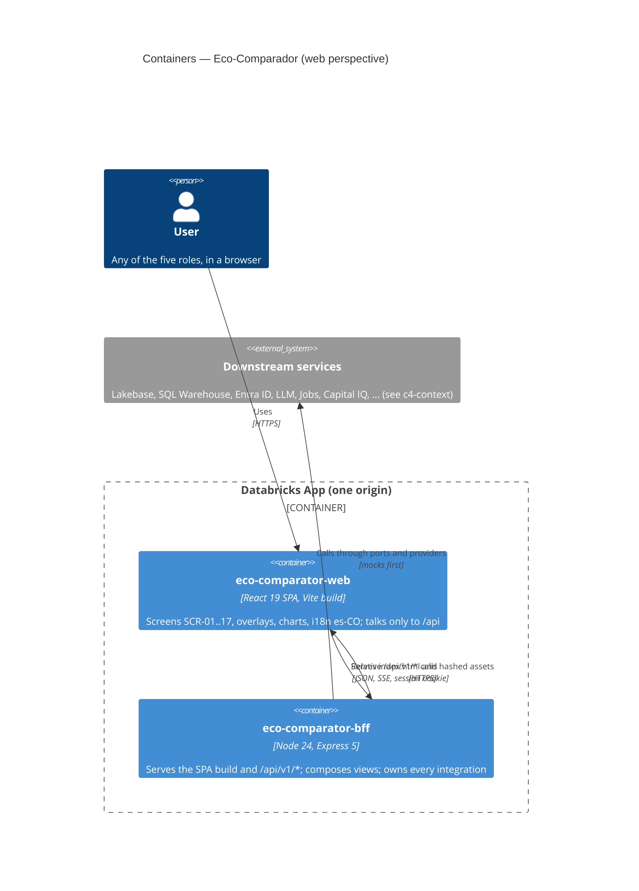
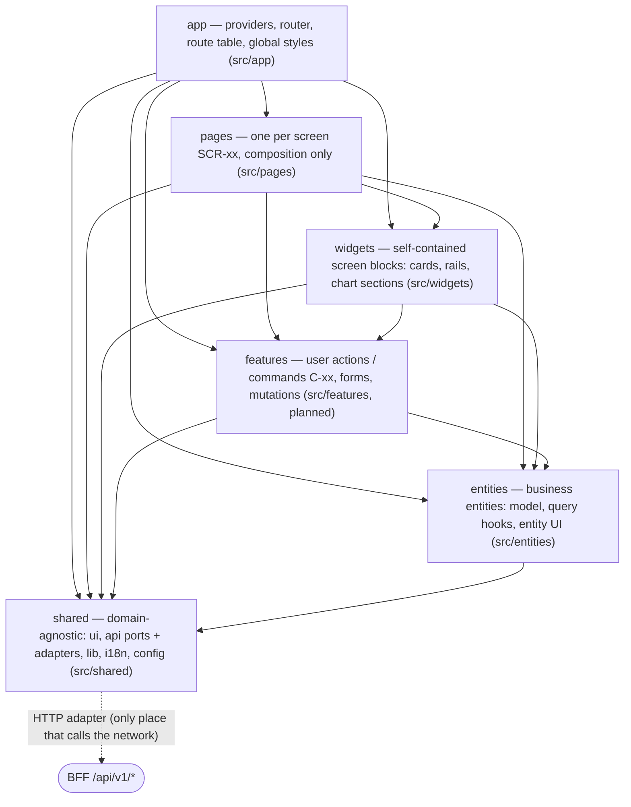

# C4 — Containers and layers of eco-comparator-web

The web app is one container: a React SPA that the BFF serves from its own public folder (same origin). Inside, the code
follows Feature-Sliced Design (`prompt_Start_Eco.md` §5.1, L443; `AGENTS.md` "Where does this file go?"). The layer rules
are enforced by `pnpm lint` and `pnpm check:architecture` (rules in `tools/architecture/fsd-rules.js`).

## Container view

## Layers (Feature-Sliced Design)

Arrows point from the importing layer to the layers it may import. A layer imports only the layers **below** it; slices
of the same layer never import each other; another slice is reached only through its public API (`<slice>/index.ts`).

| Layer | Folder | May import | Never imports |
| --- | --- | --- | --- |
| app | `src/app/` | pages, widgets, features, entities, shared | — |
| pages | `src/pages/` | widgets, features, entities, shared | app, other pages |
| widgets | `src/widgets/` | features, entities, shared | app, pages, other widgets |
| features | `src/features/` (planned) | entities, shared | app, pages, widgets, other features |
| entities | `src/entities/` | shared | app, pages, widgets, features, other entities |
| shared | `src/shared/` | nothing above it (npm packages only) | every other layer |

Where a new file goes, with the tie-breakers (a block used by two pages is a widget; anything that sends a command is a
feature; anything that knows a business term is not `shared`), is in `AGENTS.md`.
