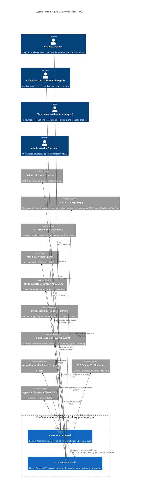

# C4 — System context

Eco-Comparador (BencHUD) is two repositories that deploy as one Databricks App (ADR-0007 of the BFF): the React SPA
`eco-comparator-web` and the Node/Express BFF `eco-comparator-bff`. Sources: `prompt_Start_Eco.md` §1 "Contexto de
arquitectura end-to-end" (L61–74) and §2.1 "Responsabilidades" (L82–89).

**Rule:** the web talks **only** to the BFF, over relative `/api/v1/*` calls on the same origin with the session cookie.
It never calls Databricks, Lakebase, Entra ID, Capital IQ or any other downstream service, and never sees their tokens.
The web is the BFF's only client; the BFF owns every external integration (all of them start as mocks,
`PROVIDERS_DEFAULT=mock`).

| Knows | `eco-comparator-web` | `eco-comparator-bff` |
| --- | --- | --- |
| Purpose | Paint screens and interactions | Serve those screens, and nothing else |
| Knows about | Only the BFF HTTP contract | The contract and every external service |
| Business logic | None (locale formatting and interaction logic only) | Aggregation, derivations, authorization, orchestration |
| Downstream tokens and secrets | Never | Holds and uses them |

Related documents: `docs/architecture/c4-containers.md` (layers of the web app), `docs/design/view-data-contracts.md`
(the contract the web consumes), `docs/architecture/adr/0004-contract-consumption.md` (how the web consumes it).
